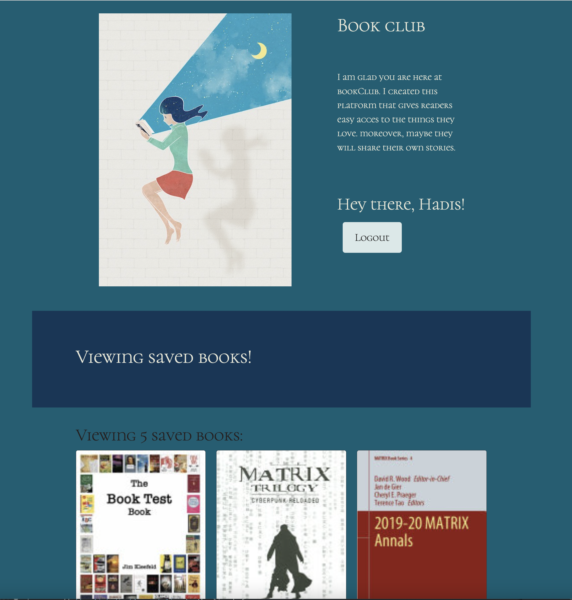

# <book-club>
<!-- PROJECT LOGO -->
<br />
<div align="center">
  <a href="https://github.com/HadisParsa/vigilance-fullstack">
    
  </a>

</div>

# Book Club
Book club i is full-stack MERN app, meaning it uses MongoDB, Express.js, REACT and Node.js.
With this app, book lovers will be able to access a wide variety of books and share their own stories with others beyond borders. 

## Summery 

```md
In this website book lovers can have: 
easy access to search for new books to read
if they lohin they can keep a list of books to purchase
they also can save and delete it to have their own club gallery.
Moreover, they can share their own thoughts and stories with other users.
```` 

## Built with

* LOVE
* React for the front end.
* GraphQl with Node.js and Express.js server.
* MongoDB and Mongoose ODM for the databese.
* Third party API
* queries and mutations for retreving, adding, updating and deleting data.

## Link

The web application's appearance:

[https://hadis-book-club.herokuapp.com/](https://hadis-book-club.herokuapp.com/)

## Getting Started

### Installation and Setup

Firstly, you must clone the code to your machine.
After the code has been cloned, open the root folder and run the command line. 

Install the npm dependencies:
```md
npm i 
````
This will install all dependencies necessary for the application to run.

Then:

1. Rename .env.EXAMPLE -> .env in the server folder
2. Update the jwt secret to a random value. This will be used to sign your json web tokens. If someone else knows what this is they will be able to login as anyone!

### Running the application

To get a local copy up and running follow these simple example steps.

To start in develop mode:
```md
npm run develop
````
This will start both the front-end and backend in watch mode

To start the services independently: Front end:
```md
cd client && npm start
````
```md
Back end:
```md
cd server && npm watch
````

# This following image shows the web application's appearance and functionality:




# If user not login they do not have access to the save buttons:


